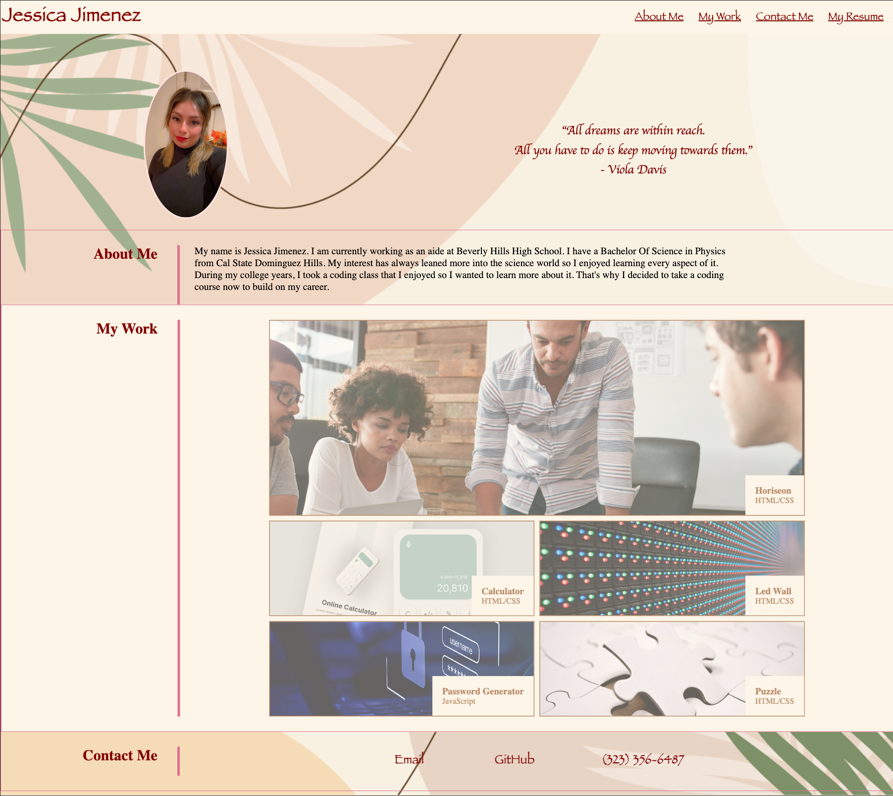

# Portfolio-code

## Description
A personal portfolio of work that showcases my skills and talents. 

Applied what I have learned to create a portfolio that I'll be able to use to demostrate my work. I was able to design a website and use my creativity skills.

## Features 
* Added a photo of myself
* Created different sections: About Me, My Work and Contact information.
* A link to my PDF resume
* Added one web application to showcase
* Added placeholder images and names

## Website Preview

## Link Deploy Application

[Deploy Application](https://jjimenez174.github.io/Portfolio-code/)
